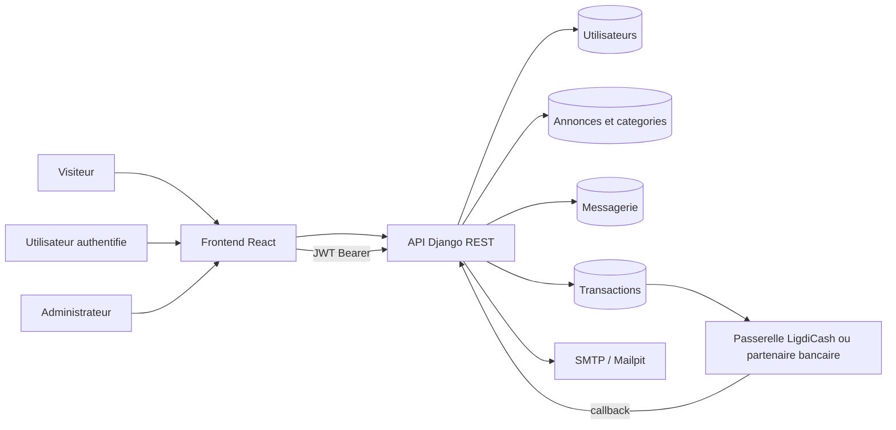
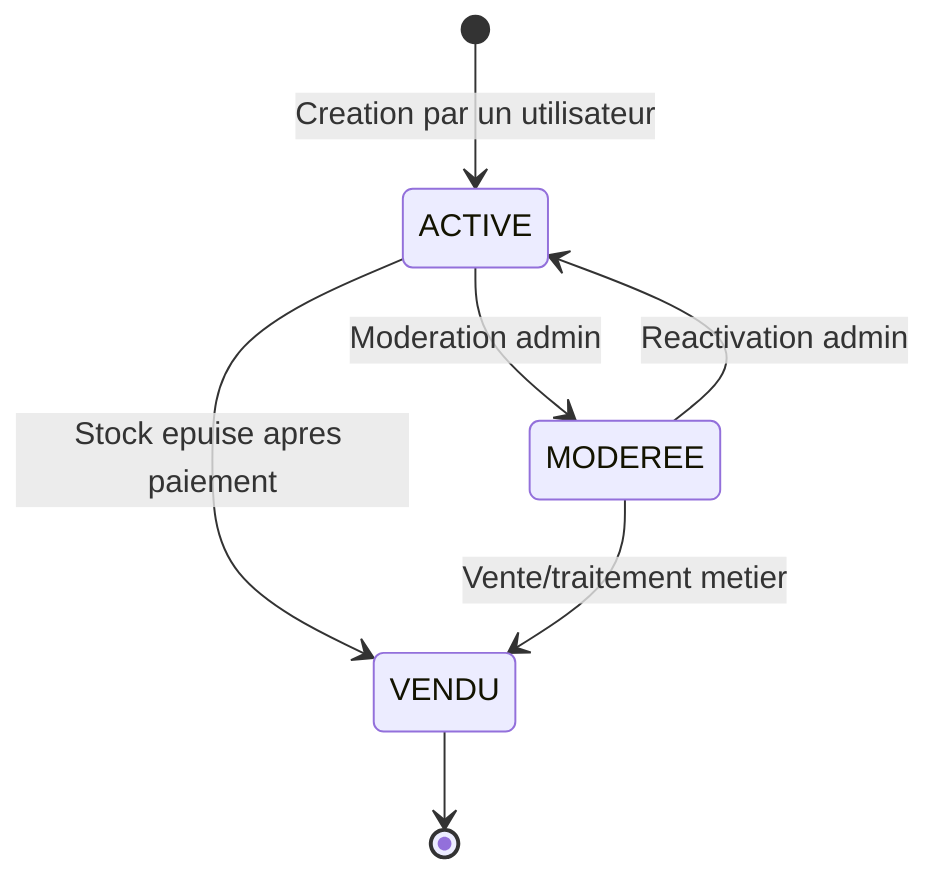
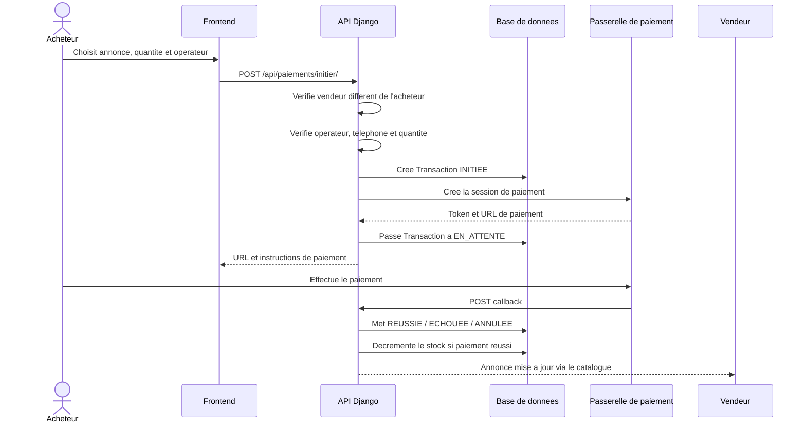
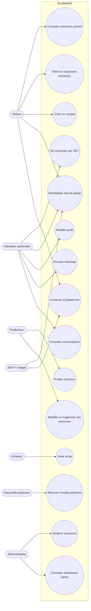

# TerreMerGn — Modèle de données et cas d'utilisation

> Document dérivé des modèles Django, serializers, permissions et services actuellement présents dans le projet.
>
> Les blocs Mermaid peuvent être visualisés dans GitHub, GitLab, VS Code avec une extension Mermaid, ou Mermaid Live.

## 1. Vue d'ensemble

TerreMerGn met en relation des producteurs guinéens et des acheteurs autour de trois secteurs: pêche, élevage et agriculture.

Les principaux domaines sont:

- **Comptes**: utilisateurs, rôles, profils et authentification JWT.
- **Annonces**: catégories, publications, modération et consultation.
- **Messagerie**: échanges directs entre utilisateurs, éventuellement liés à une annonce.
- **Paiements**: transactions liées à une annonce, avec Orange Money, MTN Mobile Money ou virement bancaire.

### 1.1 Acteurs

| Acteur | Responsabilités principales |
|---|---|
| Visiteur | Consulter les annonces actives, les catégories et demander un contact |
| Utilisateur authentifié | Gérer son profil, publier ses annonces, échanger des messages et acheter |
| Producteur | Publier et gérer ses annonces: pêcheur, éleveur ou agriculteur |
| Acheteur | Consulter une annonce, contacter un vendeur et initier un paiement |
| Administrateur | Consulter les statistiques et modérer toutes les annonces |
| Passerelle de paiement | Créer une session de paiement et notifier le résultat par callback |
| Serveur SMTP/Mailpit | Recevoir les e-mails de contact et de réinitialisation de mot de passe |

---

# Partie A — Diagrammes

## 2. Diagramme entité-relation

```mermaid
erDiagram
    UTILISATEUR ||--o{ ANNONCE : "publie"
    CATEGORIE ||--o{ ANNONCE : "classe"
    UTILISATEUR ||--o{ MESSAGE : "expedie"
    UTILISATEUR ||--o{ MESSAGE : "recoit"
    ANNONCE o|--o{ MESSAGE : "contexte"
    ANNONCE ||--o{ TRANSACTION : "concerne"
    UTILISATEUR ||--o{ TRANSACTION : "achete"
    UTILISATEUR ||--o{ TRANSACTION : "vend"

    UTILISATEUR {
        bigint id PK
        string username UK
        string email
        string first_name
        string last_name
        string telephone
        string localite
        string avatar
        string role
        text bio
        boolean is_active
        boolean is_staff
        datetime date_joined
    }

    CATEGORIE {
        bigint id PK
        string nom
        string secteur
        text description
    }

    ANNONCE {
        bigint id PK
        string titre
        text description
        positive_integer prix
        positive_integer quantite
        string unite
        string localite
        string image
        string statut
        bigint categorie_id FK
        bigint auteur_id FK
        datetime cree_le
        datetime modifie_le
    }

    MESSAGE {
        bigint id PK
        bigint expediteur_id FK
        bigint destinataire_id FK
        bigint annonce_id FK NULL
        text contenu
        boolean lu
        datetime envoye_le
    }

    TRANSACTION {
        bigint id PK
        string reference UK
        bigint annonce_id FK
        bigint acheteur_id FK
        bigint vendeur_id FK
        positive_integer quantite
        decimal montant
        string operateur
        string telephone_client
        string token_gateway
        string url_paiement
        string statut
        json reponse_gateway
        datetime cree_le
        datetime maj_le
    }
```

## 3. Contraintes et règles du modèle de données

### 3.1 Utilisateur

- `username` est unique via `AbstractUser`.
- `role` est limité à `PECHEUR`, `ELEVAGE`, `AGRICULTURE` ou `ACHETEUR`.
- `telephone`, `localite`, `avatar` et `bio` sont facultatifs.
- `avatar` est stocké sous `avatars/`.
- `is_staff` distingue les administrateurs de la plateforme.
- La suppression d'un utilisateur supprime ses annonces et ses messages (`CASCADE`), mais les transactions le concernant sont protégées (`PROTECT`).

### 3.2 Catégorie

- `secteur` est limité à `PECHE`, `ELEVAGE` ou `AGRICULTURE`.
- `description` est facultative.
- Une catégorie ne peut pas être supprimée si elle possède des annonces (`PROTECT`).

### 3.3 Annonce

- `titre` est obligatoire et limité à 200 caractères.
- `description` est obligatoire.
- `prix` et `quantite` sont des entiers positifs; le prix est exprimé en GNF.
- `unite` est limitée à `KG`, `TONNE`, `PIECE`, `LITRE`, `SAC` ou `AUTRE`.
- `statut` est limité à `ACTIVE`, `MODEREE` ou `VENDU`.
- `image` est facultative et stockée sous `annonces/`.
- Chaque annonce appartient à une catégorie et à un auteur.
- La catégorie est protégée par `PROTECT`.
- La suppression de l'auteur supprime ses annonces (`CASCADE`).
- Les annonces sont triées par date de création décroissante.

### 3.4 Message

- Chaque message possède un expéditeur et un destinataire.
- `contenu` est obligatoire.
- `annonce` est facultative: un message peut être général ou contextualisé par une annonce.
- Si l'annonce liée est supprimée, le message est conservé mais sa référence d'annonce devient nulle (`SET_NULL`).
- `lu` vaut `false` par défaut et est mis à `true` lors de la consultation du fil reçu.
- Les messages sont triés chronologiquement par `envoye_le`.

### 3.5 Transaction

- `reference` est unique, non éditable et générée automatiquement au format `TMG-XXXXXXXX`.
- Une transaction est liée à une annonce, un acheteur et un vendeur.
- L'annonce et les utilisateurs liés sont protégés par `PROTECT`.
- `quantite` est positive et vaut 1 par défaut.
- `montant` est un montant entier en GNF stocké dans un `DecimalField`.
- `operateur` est limité à `ORANGE_MONEY`, `MTN_MOMO` ou `BANCAIRE`.
- `statut` est limité à `INITIEE`, `EN_ATTENTE`, `REUSSIE`, `ECHOUEE` ou `ANNULEE`.
- `reponse_gateway` conserve la réponse JSON de la passerelle.
- Une transaction réussie décrémente la quantité de l'annonce; lorsque la quantité atteint zéro, l'annonce passe à `VENDU`.
- Un acheteur ne peut pas acheter sa propre annonce.
- Pour Orange Money et MTN Mobile Money, le numéro de téléphone est obligatoire.
- La quantité achetée doit être comprise entre 1 et la quantité disponible.

## 4. Diagramme des flux applicatifs



## 5. Diagramme de cycle de vie d'une annonce



> Le modèle autorise les valeurs de statut. Les transitions effectivement disponibles dans l'interface sont contrôlées par les vues et le dashboard d'administration.

## 6. Diagramme de paiement



---

# Partie B — Cas d'utilisation

## 7. Diagramme global des cas d'utilisation



## 8. Fiches des cas d'utilisation

### UC-01 — Consulter les annonces

| Élément | Description |
|---|---|
| Acteurs | Visiteur, utilisateur authentifié, administrateur |
| Précondition | Aucune pour les annonces actives; JWT requis pour voir ses annonces non actives |
| Déclencheur | L'acteur ouvre le marché ou une annonce |
| Scénario | L'API retourne les annonces actives; un auteur voit également ses propres annonces; un staff voit tout |
| Résultat | Les annonces accessibles sont affichées avec catégorie, prix, quantité et statut |
| Contraintes | Les annonces non actives ne sont pas publiques; les filtres portent sur statut, secteur, catégorie et localité |

### UC-02 — Créer un compte

| Élément | Description |
|---|---|
| Acteur | Visiteur |
| Précondition | L'utilisateur n'est pas encore authentifié |
| Données | Nom d'utilisateur, e-mail, mot de passe, prénom, nom, téléphone, localité et rôle |
| Résultat | Un utilisateur est créé avec un mot de passe haché et un rôle valide |
| Suite | L'application connecte l'utilisateur et lui remet des tokens JWT |
| Contraintes | Le mot de passe doit contenir au moins 6 caractères; le nom d'utilisateur doit être unique |

### UC-03 — Se connecter

| Élément | Description |
|---|---|
| Acteur | Utilisateur |
| Précondition | Le compte existe et est actif |
| Scénario | Le frontend envoie username/password, l'API renvoie access/refresh JWT, puis `/auth/me/` charge le profil |
| Résultat | Le token d'accès est utilisé dans l'en-tête `Authorization: Bearer` |
| Échec | Identifiants invalides ou token expiré; le frontend tente un refresh puis déconnecte si nécessaire |

### UC-04 — Réinitialiser un mot de passe

| Élément | Description |
|---|---|
| Acteur | Visiteur ou utilisateur |
| Scénario | Saisir l'e-mail, recevoir un lien signé, saisir le nouveau mot de passe et sa confirmation |
| Contraintes | Le token Django doit être valide et non expiré; le nouveau mot de passe contient au moins 6 caractères |
| Sécurité | La réponse de demande est identique que l'e-mail existe ou non, afin de ne pas révéler les comptes |
| Infrastructure | L'e-mail passe par Mailpit en local ou le SMTP de production |

### UC-05 — Gérer son profil

| Élément | Description |
|---|---|
| Acteur | Utilisateur authentifié |
| Actions | Modifier prénom, nom, e-mail et avatar; changer son mot de passe avec vérification de l'ancien |
| Résultat | Le profil est mis à jour et la navbar est rafraîchie |
| Contraintes | Le rôle et le nom d'utilisateur ne sont pas modifiables depuis le formulaire profil |

### UC-06 — Publier une annonce

| Élément | Description |
|---|---|
| Acteur | Utilisateur authentifié, généralement producteur |
| Précondition | JWT valide et catégorie existante |
| Données | Titre, description, prix GNF, quantité, unité, localité, catégorie et image facultative |
| Résultat | L'annonce est enregistrée avec l'utilisateur courant comme auteur et le statut par défaut `ACTIVE` |
| Contraintes | La catégorie doit exister; les nombres prix/quantité sont positifs |

### UC-07 — Modifier ou supprimer une annonce

| Élément | Description |
|---|---|
| Acteur | Auteur de l'annonce ou administrateur staff |
| Précondition | L'annonce existe et l'utilisateur est authentifié |
| Règle d'accès | Les méthodes sûres sont accessibles en lecture; les modifications sont autorisées à l'auteur ou au staff |
| Résultat | L'annonce est modifiée ou supprimée selon l'action |

### UC-08 — Modérer une annonce

| Élément | Description |
|---|---|
| Acteur | Administrateur `is_staff` |
| Précondition | Compte staff authentifié |
| Scénario | Ouvrir le dashboard, filtrer une annonce, passer son statut à `MODEREE` ou la réactiver à `ACTIVE` |
| Résultat | Le statut est enregistré et les statistiques sont actualisées |
| Refus | Un utilisateur non staff ne peut pas accéder au dashboard ni modifier l'annonce d'un tiers |

### UC-09 — Envoyer et lire des messages

| Élément | Description |
|---|---|
| Acteurs | Utilisateurs authentifiés |
| Scénario | Choisir un interlocuteur, envoyer un contenu, ouvrir le fil et consulter les échanges |
| Résultat | Le message est associé à l'expéditeur courant; les messages reçus non lus passent à `lu=true` à la lecture |
| Contraintes | Le fil contient uniquement les messages entre les deux utilisateurs; une annonce peut fournir un contexte facultatif |

### UC-10 — Initier un achat

| Élément | Description |
|---|---|
| Acteur | Acheteur authentifié |
| Préconditions | Annonce existante, vendeur différent de l'acheteur, quantité disponible |
| Scénario | Choisir opérateur, quantité et téléphone si nécessaire; créer la transaction; rediriger vers la passerelle |
| Résultat | Une transaction `INITIEE` puis `EN_ATTENTE` est créée avec une référence unique |
| Échecs | Quantité invalide, opérateur inconnu, téléphone absent ou indisponibilité de la passerelle |

### UC-11 — Confirmer un paiement par callback

| Élément | Description |
|---|---|
| Acteur principal | Passerelle de paiement |
| Précondition | La transaction est retrouvée par token gateway ou référence |
| Scénario | La passerelle appelle l'API avec un statut; l'API met à jour la transaction |
| Si succès | Transaction `REUSSIE`, stock décrémenté, annonce `VENDU` si stock nul |
| Si échec | Transaction `ECHOUEE` ou `ANNULEE`; le stock n'est pas décrémenté |
| Point d'attention | Le callback est public et doit être protégé par une vérification de signature ou de secret de passerelle avant production |

### UC-12 — Contacter la plateforme

| Élément | Description |
|---|---|
| Acteur | Visiteur ou utilisateur authentifié |
| Données | Nom, e-mail, téléphone facultatif, motif et message |
| Scénario | L'utilisateur remplit `/contact`, puis l'API envoie la demande à `CONTACT_EMAIL` |
| Résultat | L'utilisateur reçoit une confirmation; l'adresse saisie est utilisée comme `Reply-To` |
| Infrastructure | Mailpit en local; SMTP configuré en production |

## 9. Matrice des autorisations API

| Ressource | Visiteur | Utilisateur authentifié | Auteur | Staff |
|---|---:|---:|---:|---:|
| Lire annonces actives | Oui | Oui | Oui | Oui |
| Lire annonces non actives d'un tiers | Non | Non | Non | Oui |
| Créer une annonce | Non | Oui | Oui | Oui |
| Modifier/supprimer sa propre annonce | Non | Non applicable | Oui | Oui |
| Modifier/supprimer l'annonce d'un tiers | Non | Non | Non | Oui |
| Consulter statistiques | Non | Non | Non | Oui |
| Envoyer/lire messages | Non | Oui | Oui | Oui |
| Initier un paiement | Non | Oui | Oui sauf sa propre annonce | Oui sauf sa propre annonce |
| Callback paiement | Non authentifié | Endpoint public | Endpoint public | Endpoint public |
| Contacter la plateforme | Oui | Oui | Oui | Oui |

## 10. Points de vigilance

- Les images stockées sur le filesystem local d'un hébergeur gratuit ne sont pas persistantes; prévoir un stockage objet pour la production.
- Le callback de paiement doit être authentifié cryptographiquement par la passerelle avant d'être utilisé en production.
- L'API de contact et la demande de reset devraient être protégées contre l'abus par rate limiting ou CAPTCHA.
- Les contraintes métier comme `prix > 0`, `quantite >= 1` et `vendeur != acheteur` sont actuellement principalement contrôlées par serializers/vues, pas par des contraintes SQL.
- La relation `Transaction.vendeur` est enregistrée explicitement en plus de `Annonce.auteur`; le service de paiement doit maintenir cette cohérence.
- `token_gateway` n'est pas déclaré unique dans le modèle; l'identification par référence reste le repli prévu.
